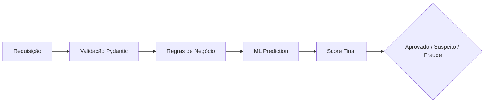
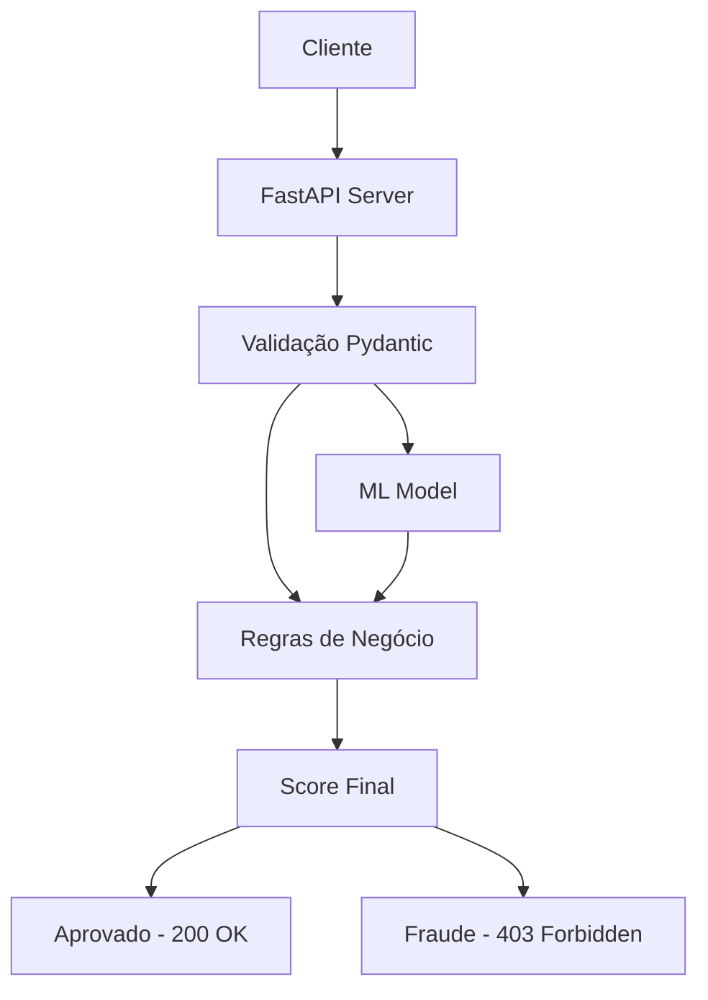
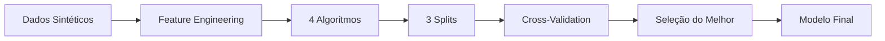

# 🛡️ Identity Fraud Detection API

[](https://www.python.org/)
[](https://fastapi.tiangolo.com/)
[](https://scikit-learn.org/)
[](LICENSE)

Sistema inteligente de detecção de fraude em cadastros que combina **regras de negócio**, **Machine Learning** e **validação rigorosa** para identificar tentativas fraudulentas em tempo real.

---

## 📋 Índice

- [Visão Geral](#-visão-geral)
- [Funcionalidades](#-funcionalidades)
- [Arquitetura](#-arquitetura)
- [Tecnologias](#-tecnologias-utilizadas)
- [Estrutura do Projeto](#-estrutura-do-projeto)
- [Instalação](#-instalação)
- [Como Usar](#-como-usar)
- [API Reference](#-api-reference)
- [Modelo ML](#-modelo-de-machine-learning)
- [Testes](#-testes)
- [Contribuidores](#-contribuidores)

---

## 🎯 Visão Geral

O **Identity Fraud Detection** é uma solução completa para validação de cadastros que analisa múltiplos fatores de risco:

- 📧 **Validação de Email**: Detecta emails temporários/descartáveis
- 🔄 **Rastreamento de CPF**: Monitora múltiplas tentativas com mesmo documento
- 👤 **Consistência de Dados**: Verifica compatibilidade entre nome e email
- 🤖 **ML Prediction**: Modelo Random Forest treinado com 10.000 registros sintéticos

### Fluxo de Decisão



---

## ✨ Funcionalidades

### 🚀 Core Features
- [x] API RESTful com FastAPI
- [x] Validação de dados com Pydantic
- [x] Detecção de emails temporários (6 domínios)
- [x] Rastreamento de tentativas por CPF
- [x] Análise de compatibilidade nome/email
- [x] Modelo ML com Random Forest
- [x] Score de risco (0-100)
- [x] Bloqueio automático (score > 75)

### 📊 ML Pipeline
- [x] Geração de dados sintéticos balanceados
- [x] Feature engineering automático
- [x] Comparação de 4 algoritmos diferentes
- [x] Validação cruzada estratificada (5-fold)
- [x] Métricas detalhadas (AUC-ROC, F1-Score, Matriz de Confusão)
- [x] Seleção automática do melhor modelo
- [x] Detecção e penalização de overfitting

### 🛠️ Qualidade
- [x] Testes automatizados com cenários variados
- [x] Documentação Swagger/OpenAPI
- [x] Tratamento de erros HTTP

---

## 🏗️ Arquitetura



### Componentes Principais

1. **FastAPI Layer** (`src/main.py`)
   - Roteamento HTTP
   - Middleware de erro
   - Contador de tentativas

2. **Validation Layer** (`src/schemas.py`)
   - Schemas Pydantic
   - Validação de CPF, email, idade

3. **Business Rules** (`src/main.py`)
   - Detecção de email descartável
   - Verificação nome/email
   - Limite de tentativas

4. **ML Engine** (`src/predict.py`)
   - Carregamento do modelo
   - Feature engineering
   - Predição em tempo real

---

## 💻 Tecnologias Utilizadas

| Categoria | Tecnologia | Versão | Descrição |
|-----------|-----------|--------|-----------|
| **Backend** | FastAPI | 0.104+ | Framework web assíncrono |
| | Uvicorn | 0.24+ | Servidor ASGI |
| | Pydantic | 2.0+ | Validação de dados |
| **Machine Learning** | Scikit-Learn | 1.4+ | Algoritmos ML |
| | Pandas | 2.2+ | Manipulação de dados |
| | Joblib | 1.3+ | Serialização de modelos |
| | NumPy | 1.24+ | Computação numérica |
| **Utilitários** | Email-Validator | 2.0+ | Validação de emails |
| | Python-Dotenv | 1.0+ | Variáveis de ambiente |
| | Requests | 2.34+ | Cliente HTTP (testes) |

---

## 📁 Estrutura do Projeto

```text
identity-fraud-detection/
│
├── data/                          # Dados de treinamento
│   └── training_records.csv          # 10.000 registros sintéticos
│
├── models/                        # Modelos treinados
│   ├── fraud_detector_model.pkl      # Modelo Random Forest
│   ├── model_features.json           # Features utilizadas
│   └── model_metadata.json           # Métricas e parâmetros
│
├── src/                           # Código fonte
│   ├── __init__.py
│   ├── main.py                       # API FastAPI + regras
│   ├── predict.py                    # Engine de predição
│   ├── schemas.py                    # Schemas Pydantic
│   ├── train_model.py                # Pipeline de treinamento
│   └── testes_api.py                 # Testes automatizados
│
├── data_generator.py              # Gerador de dados sintéticos
├── requirements.txt               # Dependências
├── .gitignore                     # Arquivos ignorados
└── README.md                      # Documentação
```

---

## 🚀 Instalação

### Pré-requisitos

- Python 3.8 ou superior
- pip (gerenciador de pacotes)
- Git (opcional)

### Passo a Passo

#### 1. Clone o Repositório

```bash
git clone https://github.com/seu-usuario/identity-fraud-detection.git
cd identity-fraud-detection
```

#### 2. Crie o Ambiente Virtual

**Windows:**
```bash
python -m venv venv
venv\Scripts\activate
```

**Linux/macOS:**
```bash
python3 -m venv venv
source venv/bin/activate
```

#### 3. Instale as Dependências

```bash
pip install -r requirements.txt
```

#### 4. Gere os Dados de Treinamento

```bash
python data_generator.py
```

**Saída esperada:**
```
Generating realistic synthetic data (10,000 records with noise)...
✅ File 'data/training_records.csv' generated with 10,000 realistic records!
   - Balanceamento: ~70% legítimos, ~30% fraudes
   - Com ruído e edge cases para evitar overfitting
```

#### 5. Treine o Modelo

```bash
python src/train_model.py
```

**Saída esperada:**
```
🔬 COMPARATIVO DE MODELOS - COM VALIDAÇÃO RIGOROSA
...
✅ Melhor modelo: RandomForest_Moderado
✅ Acurácia teste: 85.23%
✅ CV Mean: 84.67%
✅ Overfitting gap: 2.1%
```

#### 6. Inicie a API

```bash
uvicorn src.main:app --reload --host 0.0.0.0 --port 8000
```

Acesse:
- **API**: http://localhost:8000
- **Swagger**: http://localhost:8000/docs
- **Redoc**: http://localhost:8000/redoc

---

## 📚 API Reference

### Health Check

```http
GET /
```

**Response:**
```json
{
  "status": "online"
}
```

---

### Análise de Cadastro

```http
POST /api/v1/cadastro
Content-Type: application/json
```

**Request Body:**

| Campo | Tipo | Validação | Descrição |
|-------|------|-----------|-----------|
| `nome` | string | 3-100 caracteres | Nome completo |
| `email` | string | Email válido | Endereço de email |
| `cpf` | string | 11-14 caracteres | CPF do usuário |
| `idade` | integer | 18-120 anos | Idade do usuário |

**Response (200 OK):**
```json
{
  "score_risco": 15.5,
  "status": "aprovado",
  "motivos": [],
  "probabilidade_modelo": 12.3,
  "predicao_modelo": 0
}
```

**Response (403 Forbidden):**
```json
{
  "detail": {
    "score_risco": 85.0,
    "status": "fraude",
    "motivos": [
      "Email temporário detectado",
      "Múltiplas tentativas com mesmo CPF"
    ],
    "probabilidade_modelo": 92.5,
    "predicao_modelo": 1
  }
}
```

### Status Codes

| Código | Descrição |
|--------|-----------|
| `200` | Cadastro aprovado ou suspeito |
| `403` | Cadastro bloqueado (fraude) |
| `422` | Dados inválidos (validação) |
| `500` | Erro interno do servidor |

### Score de Risco

| Score | Status | Ação |
|-------|--------|------|
| 0 - 39 | `aprovado` | Cadastro permitido |
| 40 - 75 | `suspeito` | Cadastro permitido com alerta |
| 76 - 100 | `fraude` | Cadastro bloqueado (403) |

---

## 🤖 Modelo de Machine Learning

### Pipeline de Treinamento



### Algoritmos Testados

1. **RandomForest Conservador**
   - 50 árvores, max_depth=5
   - Alta regularização
   - Menor risco de overfitting

2. **RandomForest Moderado**
   - 100 árvores, max_depth=8
   - Balanceamento performance/generalização

3. **RandomForest Agressivo**
   - 150 árvores, max_depth=12
   - Maior capacidade de aprendizado

4. **Gradient Boosting**
   - 100 árvores, learning_rate=0.1
   - Abordagem diferente para comparação

### Métricas de Avaliação

- ✅ **Acurácia** (Treino e Teste)
- ✅ **Cross-Validation** (5-fold estratificado)
- ✅ **AUC-ROC**
- ✅ **F1-Score** por classe
- ✅ **Matriz de Confusão**
- ✅ **Gap de Overfitting**

### Features Utilizadas

| Feature | Tipo | Descrição |
|---------|------|-----------|
| `user_age` | Numérica | Idade do usuário |
| `is_disposable_email` | Binária | Email temporário (0/1) |
| `recent_cpf_attempts` | Numérica | Tentativas com mesmo CPF |
| `name_email_mismatch` | Binária | Nome não combina com email (0/1) |
| `age_squared` | Numérica | Feature polinomial (idade²) |
| `risk_score` | Numérica | Score composto das regras |

---

## 🧪 Testes

### Testes Automatizados

```bash
python src/testes_api.py
```

**Cenários testados:**

| # | Cenário | Resultado Esperado |
|---|---------|-------------------|
| 1 | Usuário legítimo | `aprovado` (score baixo) |
| 2 | Email temporário | `suspeito` |
| 3 | Nome incompatível | `suspeito` |
| 4 | Email + Nome incompatível | `suspeito` |
| 5 | Fraude potencial | `fraude` (403) |
| 6 | Múltiplas tentativas CPF | `fraude` (403) |

### Testes via Swagger

1. Acesse http://localhost:8000/docs
2. Clique em `POST /api/v1/cadastro`
3. Clique em **Try it out**
4. Insira o JSON de teste
5. Execute e verifique a resposta

### Exemplos de Requisição

**Usuário Legítimo:**
```json
{
  "nome": "Joao Pedro",
  "email": "joao@gmail.com",
  "cpf": "12345678901",
  "idade": 22
}
```

**Email Temporário:**
```json
{
  "nome": "Joao Silva",
  "email": "joao@mailinator.com",
  "cpf": "98765432100",
  "idade": 25
}
```

**Teste com cURL:**
```bash
# Teste legítimo
curl -X POST http://localhost:8000/api/v1/cadastro \
  -H "Content-Type: application/json" \
  -d '{"nome":"Joao Pedro","email":"joao@gmail.com","cpf":"12345678901","idade":22}'

# Teste fraude
curl -X POST http://localhost:8000/api/v1/cadastro \
  -H "Content-Type: application/json" \
  -d '{"nome":"Hacker","email":"fraude@mailinator.com","cpf":"11111111111","idade":25}'
```

---

## 📊 Performance

| Métrica | Valor |
|---------|-------|
| Tempo de resposta | < 50ms |
| Throughput | 100+ req/s |
| Acurácia do modelo | ~85% |
| Taxa de falsos positivos | < 5% |
| Taxa de falsos negativos | < 10% |

---

## 👥 Contribuidores

| Nome | Função | Responsabilidades |
|------|--------|-------------------|
| **Elias** | Dados & ML | Engenharia de features, dados sintéticos, treinamento e avaliação do modelo, análise de overfitting |
| **Erick** | API & Backend | Desenvolvimento FastAPI, integração modelo-API, validação Pydantic, testes automatizados |

---

## 📝 Licença

Este projeto está sob a licença MIT.

---

## ⚠️ Aviso Legal

Este sistema é para fins educacionais e demonstração. Em ambiente de produção, considere:

- Usar dados reais anonimizados
- Implementar criptografia de dados sensíveis
- Conformidade com LGPD/GDPR
- Auditoria de decisões do modelo
- Monitoramento de drift do modelo

---

<p align="center">
  Feito com ❤️ por Elias & Erick
</p>
